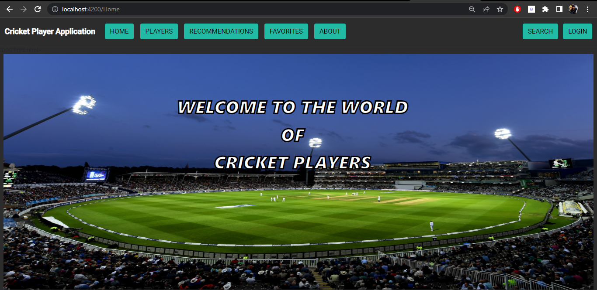
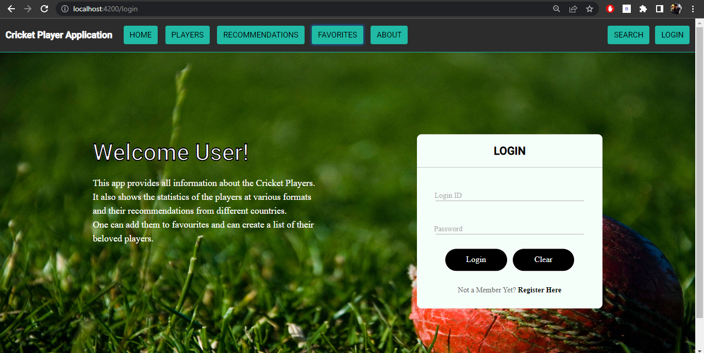
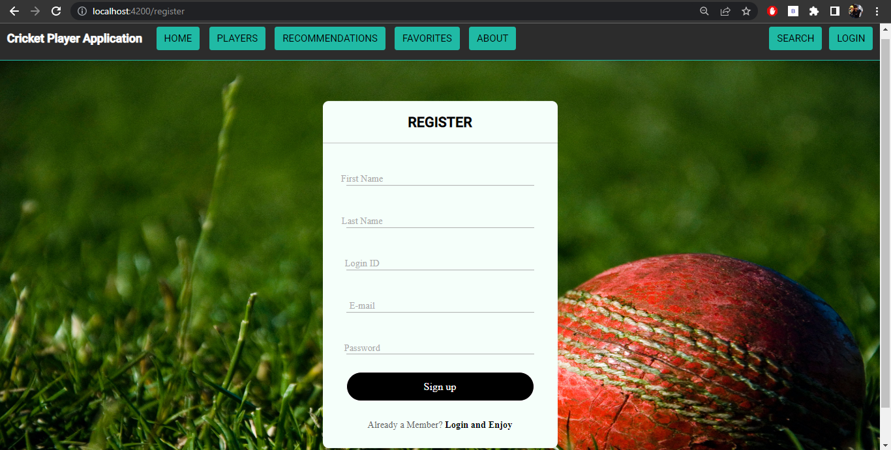
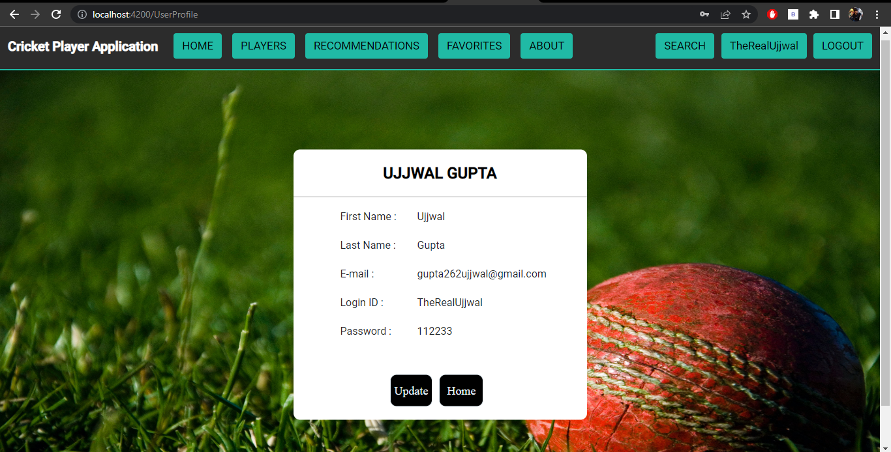
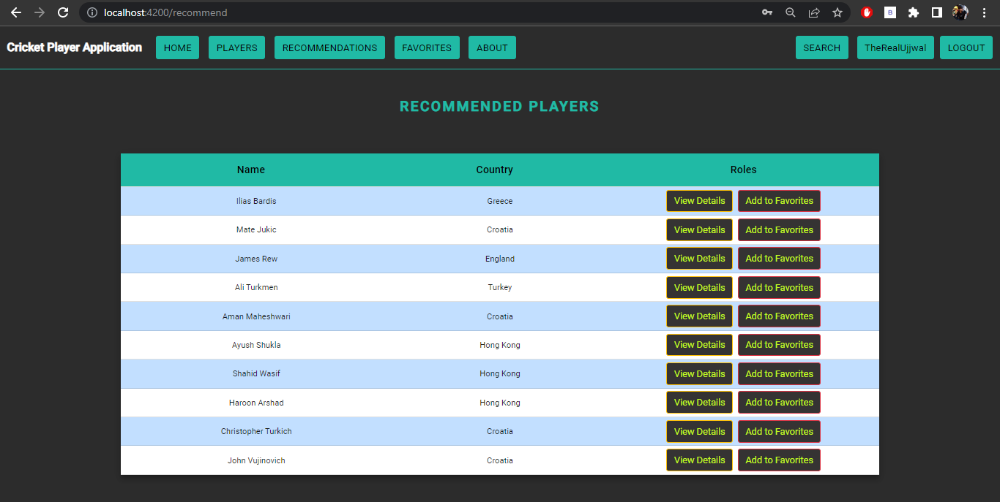
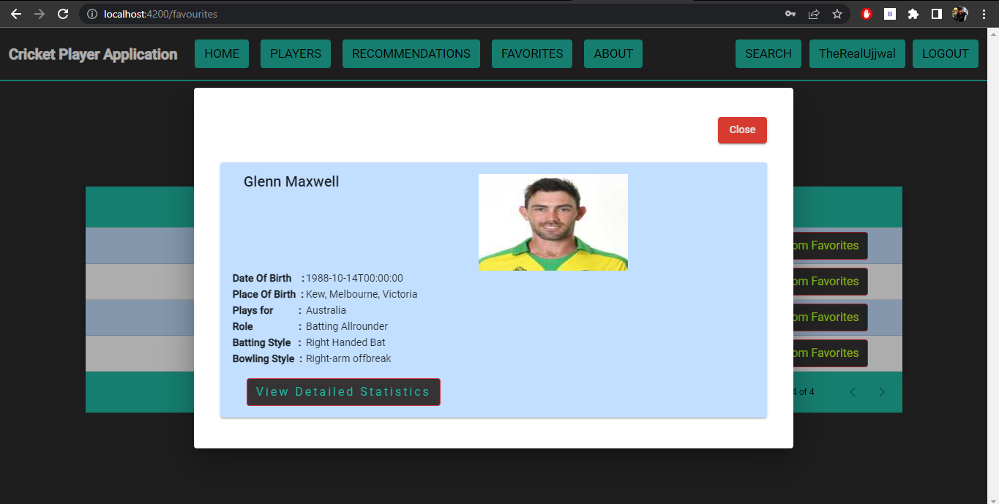
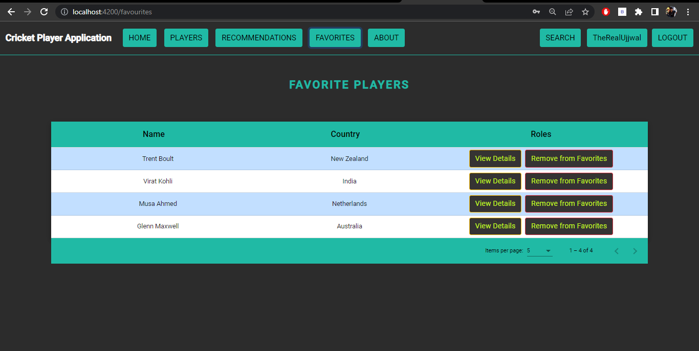
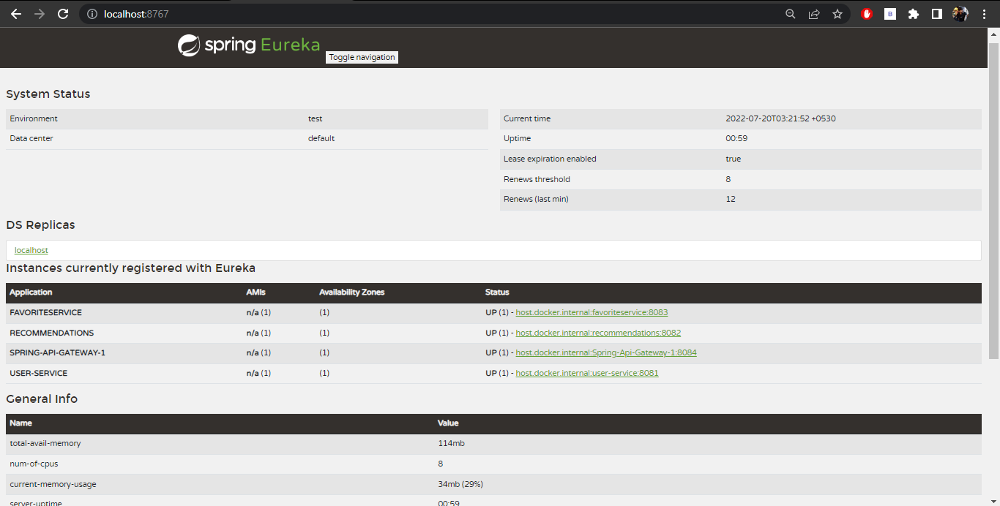

# 🏏 Cricket Player Application  

A **Full Stack Web Application** that provides complete details about cricket players.  
Users can explore player statistics, view recommendations, and manage their own favorite list.  

---

## 🚀 Features  

- 🔑 **User Authentication** (Register & Login with JWT Security)  
- 👨‍💻 **Player Information & Statistics** across different formats  
- ⭐ **Add Players to Favorites** for quick access  
- 📝 **Recommendations** from different countries  
- 🔍 **Search Players** easily  
- 📱 **Responsive UI** for desktop & mobile  

---

## 🛠️ Technologies Used  

### **Languages**
- Java  
- HTML  
- CSS  
- JavaScript  

### **Frameworks**
- Angular  
- Node.js  
- Spring (Spring Boot)  

### **Databases**
- MySQL  
- MongoDB  
- XAMPP (local server)  
- Docker (containerized DB setup)  

### **Tools**
- VS Code  
- Eclipse  
- GitHub & GitLab  
- Eureka Server (Spring Boot Microservices)  
- Postman (API Testing)  

### **Security**
- JWT (JSON Web Token) for authentication  

---

## 📸 Screenshots  

### 🏠 Home Page  
  

### 🔑 Login Page  
  

### 📝 Register Page  
  

### ⭐ Profile Page  
  

### ⭐ Recommended Players  

### ⭐ Player's Profile  

### ⭐ Favourite Players  

### ⭐ Eureka Server Configurations  

---

## ⚙️ Installation & Setup  

1. **Clone the repository**  
   
   git clone https://github.com/TheRealUjjwal/Cricket-Player-Application.git
   
   cd Cricket-Player-Application

2. **Install dependencies**

    npm install

3. **Run Angular frontend**

    ng serve

4. **Run Node.js backend (if separate)**

    node server.js

5. **Run Spring Boot backend**

    Import into Eclipse or IntelliJ, then start the application.

6. **Database Setup**

    Start MongoDB (via Docker or local installation).

📂 Folder Structure

src/
 ┣ components/      # Angular Components
 ┣ services/        # API & Data handling
 ┣ assets/          # Images & Styles
 ┗ app.module.ts    # Main app entry

👤 Author
Ujjwal Gupta – GitHub

📜 License
This project is licensed under the Apache License 2.0 – feel free to use, modify, and distribute.

